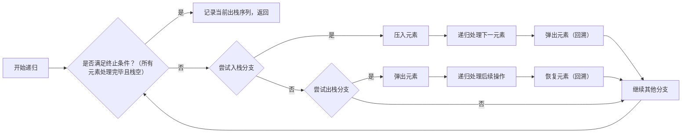

# 栈的应用——实验报告

- **班级**：通信2301
- **学号**：U202342641
- **姓名**：陶宇轩

## 一、编程实验名称与内容概述

- **实验名称**：栈的应用

- **内容概述**：设以字符序列 A、B、C、D作为顺序栈st的输入，

  利用 push(进栈)和pop(出栈)操作，输出所有可能的出栈序列并编程实现整个算法

## 二、程序设计思路

### 数据结构 

- 使用栈来模拟当前栈的状态
- 递归函数参数包括当前栈、当前的输出序列、当前已入栈的元素数目

### 算法步骤 

1. 初始时，栈为空，输出序列为空，已入栈 0 个元素
2. 在每一步：
   1. 如果还有未入栈的元素，则可以选择入栈
   2. 如果栈非空，则可以选择出栈
3. 当所有元素都已入栈且栈为空时，记录当前的输出序列

## 三、代码说明 

### 流程图



### 递归函数 `backtrack` 

#### **参数**

- `stack<char>& s`：当前栈的状态
- `string output`：当前已生成的出栈序列
- `int next_input`：下一个待处理的输入元素索引

#### **代码**

```cpp
void backtrack(stack<char>& s, const string& output, int next_input) {
    // 递归终止条件：所有元素已处理且栈为空
    if (next_input == input.size() && s.empty()) {
        all_sequences.push_back(output);
        return;
    }

    // 入栈分支
    if (next_input < input.size()) {
        s.push(input[next_input]);          // 压入当前元素
        backtrack(s, output, next_input + 1); // 递归处理下一元素
        s.pop();                            // 回溯：恢复栈状态
    }

    // 出栈分支
    if (!s.empty()) {
        char c = s.top();
        s.pop();                            // 弹出栈顶元素
        backtrack(s, output + c, next_input); // 递归处理后续操作
        s.push(c);                          // 回溯：恢复栈状态
    }
}
```

### 主函数 

- 初始化空栈并启动递归
- 遍历并输出所有生成的出栈序列

## 四、运行结果与复杂度分析 
### 运行结果 
```
所有可能的出栈序列：
DCBA
CDBA
CBDA
CBAD
BDCA
BCDA
BCAD
BADC
BACD
ADCB
ACDB
ACBD
ABDC
ABCD
```

### 复杂度分析 
- **时间复杂度**
    - 最坏情况下为` O(2^{2n}) ` 通过剪枝优化后实际为 `O(Catalan(n) * n) `
    - 其中` Catalan(n)`  为第 n 个卡特兰数 `Catalan(n) ≈ 4^n / (n^(3/2))`
    
- **空间复杂度**
  - 递归栈深度为 `O(n)`，存储结果需 `O(Catalan(n))` 空间
  

## 五、改进方向与心得体会 

### 改进方向

- **迭代替代递归**：避免递归深度过大导致的栈溢出问题
- **备忘录机制**：记录已处理的子状态，避免重复计算

### 心得体会 

- **栈的应用**：在回溯算法中使用了栈的“后进先出”特性
- **回溯法**：通过递归+状态恢复穷举解空间
- **剪枝重要性**：合理剪枝可显著提升算法效率
- 学到了一个新的数学知识：**卡特兰数**
  - 了解了其在 合法括号序列，路径计数等问题上的应用
