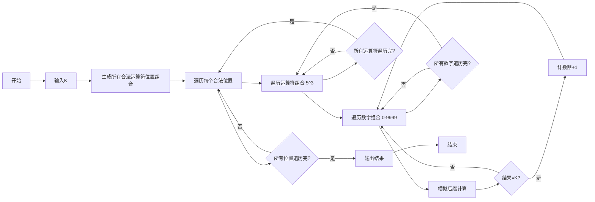

# 后缀表达式2025——实验报告

- **班级**：通信2301
- **学号**：U202342641
- **姓名**：陶宇轩

## 一、编程实验名称与内容概述

- **实验名称**：后缀表达式2025
- **内容概述**：统计满足特定条件的后缀表达式字符串的数量。条件包括：字符串由4个数字和3个运算符组成，构成合法的后缀表达式，计算结果等于给定的K，并且运算过程中没有除零或模零的情况。

## 二、程序设计思路 

### 数据结构 
1. **向量（`vector`）**：存储运算符位置、数字映射关系及有效位置组合
2. **栈（`stack`）**：模拟后缀表达式的计算过程
3. **数组**：预定义运算符列表（`ops_list`）和数字位置映射

### 算法步骤 
1. **生成合法运算符位置**
   - 遍历所有可能的3个运算符位置组合（共 C(7,3) = 35 种）通过栈模拟验证合法性
   - 合法条件：遍历表达式时，栈大小始终 ≥2 且最终栈大小为 1
2. **遍历运算符与数字组合**
   - 对每个合法位置组合，生成所有可能的运算符 5^3=125 种 和 4位数字 0 - 9999 共 10000 种组合
3. **模拟表达式计算**
   - 用栈处理表达式，遇到数字压栈，遇到运算符弹出栈顶两元素计算后压栈结果
   - 处理除零错误，记录有效结果

## 三、代码说明 

### 流程图 


### 核心函数 
#### 1. 合法性验证函数 `is_valid`

- 通过栈大小动态验证表达式结构，而非实际计算值
- 剪枝提前过滤掉无效位置组合

```cpp
bool is_valid(const vector<int>& pos) {
    vector<bool> is_op(7, false);  // 标记运算符位置
    for (int p : pos) is_op[p] = true;

    int stack_size = 0;  // 模拟栈大小
    for (int i = 0; i < 7; i++) {
        if (is_op[i]) {  // 遇到运算符
            if (stack_size < 2) return false;  // 栈元素不足，非法
            stack_size--;  // 弹出两个元素，压入一个结果
        } else {  // 遇到数字
            stack_size++;  // 压栈操作
        }
    }
    return stack_size == 1;  // 最终栈需只剩一个元素
}

```
#### 2. 数字位置预处理

- 将离散的数字位置（如`[0,2,4,6]`）映射到连续的4位数字索引（0→0, 2→1, 4→2, 6→3）

```cpp
vector<int> digits_pos, digit_map(7, -1);
for (int i = 0; i < 7; i++) {
    if (!is_op[i]) {  // 数字位置处理
        digits_pos.push_back(i);  // 记录数字索引顺序
        digit_map[i] = digits_pos.size() - 1;  // 建立位置到数字索引的映射
    }
}
```

#### 3. 运算符预处理

- 将离散的运算符位置（如`[1,3,5]`）映射到运算符组合索引（1→0号运算符，3→1号，5→2号）

```cpp
vector<int> op_indices(7, -1);
for (int k = 0; k < 3; k++) {
    op_indices[valid_pos[k]] = k;  // 标记每个运算符在组合中的顺序
}
```
#### 4. 表达式计算核心逻辑

- 计算表达式

```cpp
for (int i = 0; i < 7 && valid; i++) {
    if (op_indices[i] != -1) { // 处理运算符
        if (sp < 2) { valid = false; continue; }
        int a = stack[sp-2], b = stack[sp-1];
        sp -= 2;
        char op = ops[op_indices[i]];

        if ((op == '/' || op == '%') && b == 0) {
            valid = false;
            continue;
        }

        int res;
        switch(op) {
            case '+': res = a + b; break;
            case '-': res = a - b; break;
            case '*': res = a * b; break;
            case '/': res = a / b; break;
            case '%': res = a % b; break;
        }
        stack[sp++] = res;
    } else { // 处理数字
        stack[sp++] = digits[digit_map[i]];
    }
}
```
#### 5. 数字组合生成

- 包含所有4位数的排列组合（0000-9999）

```cpp
for (int num = 0; num < 10000; num++) {
    vector<int> digits = {
        num / 1000,        // 千位
        (num / 100) % 10,  // 百位
        (num / 10) % 10,   // 十位
        num % 10           // 个位
    };
}
```
## 四、运行结果与复杂度分析 

### 运行结果 

```
6561
5
```


### 复杂度分析 
#### 时间复杂度

- 生成合法位置组合：`O(7^3)` 
- 遍历运算符组合：`O(5^3=125)` 
- 遍历数字组合：`O(10^4=10000)` 
- 总复杂度：`O(7^3 × 125 × 10000 × 7) ≈ 8.75×10^9` 次操作 

#### 空间复杂度

- 存储有效位置组合：`O(C)`（C为合法位置数） 
- 临时存储数字和运算符：`O(1)` 

## 五、改进方向与心得体会 

### 改进方向 
- **剪枝优化**：在生成数字组合时，若中间计算结果已超过 `K` 的可能范围，提前终止计算
- **并行计算**：将运算符和数字组合的遍历拆分为多线程任务，提升效率

### 心得体会  
- **后缀表达式特性**：通过栈模拟计算
- **暴力枚举的局限性**：一开始的时候尝试用暴力枚举，但时间复杂度较高，后续使用剪枝优化
- **预处理的思想**：数字位置和字符位置的预处理
  - 将离散的位置映射到连续的索引
  - 将O(n)计算转为O(1)查询 

