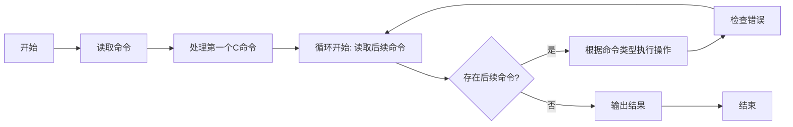

# 线性表编程实验2025——实验报告

- **班级**：通信2301
- **学号**：U202342641
- **姓名**：陶宇轩

## 一、编程实验名称与内容概述 
- **实验名称**：基于线性表的命令行操作实现 
- **内容概述**：设计一个存储整数（测试用例仅使用不超过1000的非负整数）的线性表（建议用链表实现，也可以用STL库），根据标准输入对线性表进行操作。

## 二、程序设计思路 
### 数据结构
- 用`std::vector<int>`模拟线性表

### 命令实现分析 
1. **创建线性表**
      **命令**：C m
   * m 为非负整数，表示创建一个长度为 m 的线性表，并依次填充 0 到 m-1 的整数。
   * m=0 时创建空表。
   * **测试用例保证 C 是第一个命令且合法**。
2. **插入整数**
      **命令**：I x y
   * 在位置 x（从0开始编号）插入值 y。
   * 若 x 不合法（如越界），输出 X 并终止。
3. **删除单个元素**
      **命令**：D x
   * 删除位置 x 的元素。
   * 若 x 不合法，输出 X 并终止。
4. **批量删除元素**
      **命令**：E x y
   * 删除区间 [x, y]（含 x 和 y）内的所有元素。
   * 若 x 或 y 不合法，输出 X 并终止。
5. **清除线性表**
      **命令**：CLR
   * 清空线性表，无输出。
6. **返回线性表长度**
      **命令**：LEN
   * 输出当前线性表的长度并终止程序。例如，长度为3时输出 3。
7. **返回指定位置元素**
      **命令**：GET pos
   * 输出位置 pos 的元素值并终止程序。
   * 若 pos 不合法，输出 X 并终止。
8. **输出线性表**
      **命令**：P
   * 输出线性表的所有元素（空格分隔）。
   * 空表输出 EMPTY。

## 三、代码说明 
### 关键代码段与注释 
#### 1. 初始化命令（C m） 
```cpp  
// 处理初始化命令C，格式：C m（创建包含0到m-1的列表）
getline(cin, line);
istringstream iss(line);
string cmd;
iss >> cmd;
if (cmd != "C") {
    cout << "X" << endl;  // 首命令非C则报错
    return 0;
}
int m;
iss >> m;
list.clear();
for (int i = 0; i < m; ++i) {
    list.push_back(i);  // 初始化0,1,...,m-1
}
```

#### 2. 插入操作（I x y） 
```cpp  
// 处理插入命令I，格式：I x y（在位置x插入y）
if (cmd == "I") {
    int x, y;
    iss >> x >> y;
    if (x < 0 || x > list.size()) {  // 检查x有效性
        cout << "X" << endl;
        return 0;
    }
    list.insert(list.begin() + x, y);
}
```

#### 3. 删除单个元素  (D x)

```cpp
// 处理删除命令D，格式：D x（删除位置x的元素）
else if (cmd == "D") {
    int x;
    iss >> x;
    if (x < 0 || x >= list.size()) {
        cout << "X" << endl;
        return 0;
    }
    list.erase(list.begin() + x);
}
```

#### 4. 批量删除操作（E x y） 

```cpp  
// 处理范围删除命令E，格式：E x y（删除x到y的元素）
else if (cmd == "E") {
    int x, y;
    iss >> x >> y;
    if (x < 0 || y >= list.size() || x > y) {  // 检查范围有效性
        cout << "X" << endl;
        return 0;
    }
    list.erase(list.begin() + x, list.begin() + y + 1);
}
```

#### 5. 返回指定位置元素 (GET pos)

```cpp
// 处理元素获取命令GET，格式：GET pos（输出指定位置元素）
else if (cmd == "GET") {
    int pos;
    iss >> pos;
    if (pos < 0 || pos >= list.size()) {
        cout << "X" << endl;
        return 0;
    }
    cout << list[pos] << endl;
    terminated = true;
}
```

#### 6. 输出线性表（P） 

```cpp  
// 处理打印命令P（输出所有元素）
else if (cmd == "P") {
    if (list.empty()) {
        cout << "EMPTY" << endl;
    } else {
        for (size_t i = 0; i < list.size(); ++i) {
            if (i > 0) cout << " ";
            cout << list[i];
        }
        cout << endl;
    }
    terminated = true;
}
```

### 流程图


## 四、运行结果与复杂度分析 
### 时间复杂度分析 

#### 时间复杂度

| 命令    | 时间复杂度 | 说明                  |
| ------- | ---------- | --------------------- |
| C m     | O(m)       | 初始化需要填充m个元素 |
| I x y   | O(n)       | 插入需要移动元素      |
| D x     | O(n)       | 删除需要移动元素      |
| E x y   | O(n)       | 批量删除需要移动元素  |
| CLR     | O(1)       | 直接清空容器          |
| LEN     | O(1)       | 直接返回size()        |
| GET pos | O(1)       | 直接访问元素          |
| P       | O(n)       | 遍历所有元素输出      |

#### 空间复杂度 
- **空间复杂度**：O(m)，其中m是线性表的最大长度

## 五、改进方向与心得体会 
### 改进方向 
- 使用链表代替`vector`，可将插入和删除操作的时间复杂度降低到`O(1)`
- 在命令解析时提前判断参数数量是否合法
- 添加更多异常处理逻辑，例如输入非数字字符时的容错

### 心得体会 

- `vector`在随机访问和简单操作中表现良好，但插入/删除频繁时效率较低
