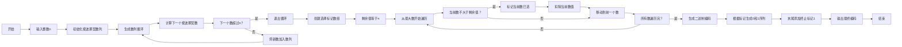

# 斐波那契编码——实验报告

- **班级**：通信2301  
- **学号**：U202342641  
- **姓名**：陶宇轩  

## 一、编程实验名称与内容概述  

- **实验名称**：斐波那契编码的生成与实现  
- **内容概述**： 
  通过贪心算法将输入整数转换为斐波那契编码。编码规则为：  
  1. 生成斐波那契数列直至超过输入值
  2. 从大到小选择斐波那契数之和等于输入值
  3. 根据选中的数生成二进制编码，并以终止符 `1` 结尾

## 二、程序设计思路  

#### 数据结构  
- **`vector<int> fib`**：存储斐波那契数列（初始为 `{1, 2}`，逐步生成后续数）。  
- **`vector<bool> selected`**：标记选中的斐波那契数（索引对应数列位置）。  

#### 算法步骤  
1. **生成数列**：动态生成斐波那契数列直至超过输入值 `n`。  
2. **贪心选择**：从最大斐波那契数开始，依次选择不超过剩余值的数，标记并减去该数。  
3. **生成编码**：根据标记数组生成二进制字符串，末尾添加终止符 `1`。  

## 三、代码说明  

### 流程图  



### 流程图逻辑解析：
1. **初始化阶段**：输入 `n` 并初始化斐波那契数列。
2. **数列生成循环**：动态生成斐波那契数，直到超过 `n`。
3. **贪心选择阶段**：从最大数开始遍历，标记选中的数并更新剩余值。
4. **编码生成**：根据标记生成二进制字符串，末尾添加终止符 `1`。

此版本符合 Mermaid 语法规范，可正常渲染。


### 主函数  

**功能**：  
1. 输入整数 `n`。  
2. 生成斐波那契数列：  
   ```cpp  
   vector<int> fib = {1, 2};  
   while (true) {  
       int next = fib.back() + fib[fib.size()-2];  
       if (next > n) break;  
       fib.push_back(next);  
   }  
   ```
3. 贪心选择斐波那契数：  
   ```cpp  
   int remaining = n;  
   for (int i = max_idx; i >= 0; --i) {  
       if (fib[i] <= remaining) {  
           selected[i] = true;  
           remaining -= fib[i];  
       }  
   }  
   ```
4. 生成编码并输出：  
   ```cpp  
   string code;  
   for (bool used : selected) code += used ? '1' : '0';  
   code += '1';  
   ```

---

## 四、运行结果与复杂度分析  

### 运行结果  
- **输入**：7 
  **输出**：01011 
  **解释**：选中的斐波那契数为 5 和 2，对应二进制 `0 1 0 1`，加终止符 `1`。  

- **输入**：`10`  
  **输出**：`1001011`  
  **解释**：选中的斐波那契数为 `8`、`2`，对应二进制 `1 0 0 1 0`，加终止符 `1`。  

### 复杂度分析  
- **时间复杂度**：  
  - 生成数列：`O(k)`，`k` 为斐波那契数列长度（`k ≈ log_φ(n√5)`，φ为黄金分割率）。  
  - 贪心选择：`O(k)`。  
  - 总时间复杂度：`O(log n)`。  
- **空间复杂度**：`O(k)`，存储斐波那契数列和标记数组。  

---

## 五、改进方向与心得体会  

### 改进方向  
1. **优化数列生成**：预生成更大范围的斐波那契数列以减少重复计算。  
2. **大数处理**：使用字符串或高精度库处理超出 `int` 范围的输入。  

### 心得体会  
通过实验深入理解了贪心算法在编码问题中的应用，以及斐波那契编码的唯一性和终止符设计的巧妙性。同时，动态生成数列的过程体现了算法与数据结构的紧密关联。